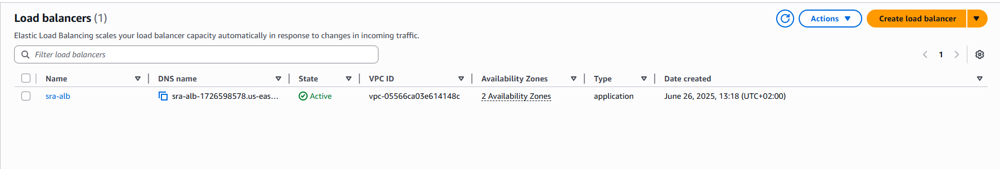
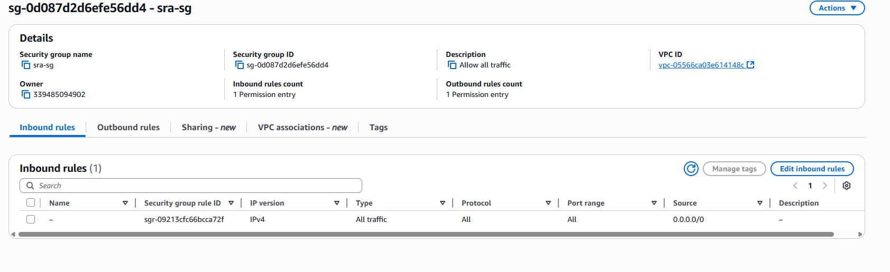
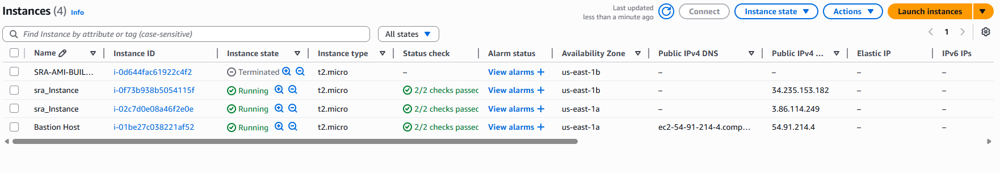
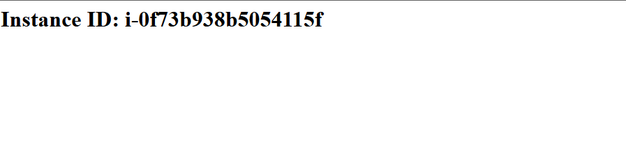
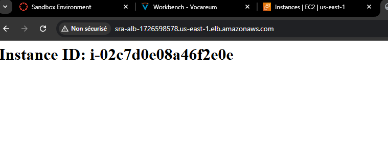

# 🚀 Déploiement AWS avec Terraform

Ce projet permet de déployer une infrastructure de base sur AWS via Terraform.

---

## 📁 Fichiers Terraform

### 1. `main.tf`
Contient la définition des **ressources principales** :
- VPC, Subnets publics/privés
- Load Balancer (ALB)

- Groupes de sécurité

- Target Groups et autres composants réseau
- 2 instance


C’est le **cœur** de l’infrastructure.


---

### 2. `variables.tf`
Déclare toutes les **variables d’entrée** utilisées dans `main.tf` :
- CIDR, zones de disponibilité (az1, az2)
- Noms, ports, etc.

Permet de personnaliser l’infra sans modifier le code principal.

---

### 3. `outputs.tf`
Affiche les **informations utiles** après l’exécution :
- URL du Load Balancer
- IDs des subnets, VPC, etc.

Facilite la récupération rapide des ressources créées.

---

### 4. `Instance web`
Voici les captures prouvant que les instances derrière le Load Balancer répondent correctement :
- Instance 1 : 
- Instance 2 : 

Facilite la récupération rapide des ressources créées.

---

## ▶️ Commandes de base

```bash
terraform init     # Initialise Terraform
terraform apply    # Déploie l'infrastructure
